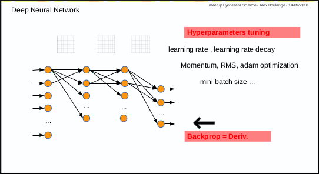
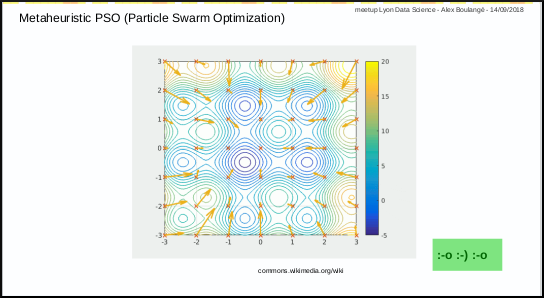
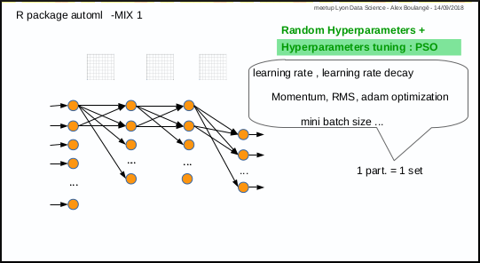
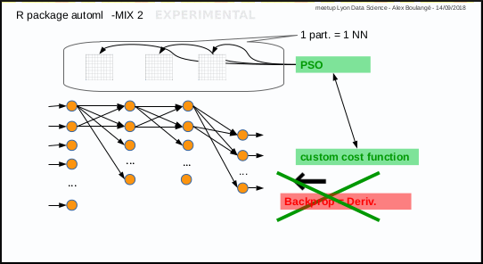

```{r setup, include=FALSE}
knitr::opts_chunk$set(echo = TRUE)
require(automl)
```
<body>
<h2 id="contents" class="likechapterHead"><span id="x1-1000"></span>Contents</h2>
<div class="tableofcontents">
 <span class="sectionToc">0.1 <a href="#x1-20000.1" id="QQ2-1-2">Introduction to automl package</a></span><br />
 <span class="sectionToc">0.2 <a href="#x1-30000.2" id="QQ2-1-3">Why &amp; how automl</a></span><br />
  <span class="subsectionToc">0.2.1 <a href="#x1-40000.2.1" id="QQ2-1-4">Deep Learning existing frameworks, disadvantages</a></span><br />
  <span class="subsectionToc">0.2.2 <a href="#x1-50000.2.2" id="QQ2-1-5">Neural Network - Deep Learning, disadvantages</a></span><br />
  <span class="subsectionToc">0.2.3 <a href="#x1-60000.2.3" id="QQ2-1-6">Metaheuristic - PSO, benefits</a></span><br />
  <span class="subsectionToc">0.2.4 <a href="#x1-70000.2.4" id="QQ2-1-7">Birth of automl package</a></span><br />
  <span class="subsectionToc">0.2.5 <a href="#x1-80000.2.5" id="QQ2-1-8">Mix 1: hyperparameters tuning with PSO</a></span><br />
  <span class="subsectionToc">0.2.6 <a href="#x1-90000.2.6" id="QQ2-1-9">Mix 2: PSO instead of gradient descent</a></span><br />
 <span class="sectionToc">0.3 <a href="#x1-100000.3" id="QQ2-1-10">First steps: How to</a></span><br />
  <span class="subsectionToc">0.3.1 <a href="#x1-110000.3.1" id="QQ2-1-11">fit a regression model manually (hard way)</a></span><br />
  <span class="subsectionToc">0.3.2 <a href="#x1-120000.3.2" id="QQ2-1-12">fit a regression model automatically (easy way, Mix 1)</a></span><br />
  <span class="subsectionToc">0.3.3 <a href="#x1-130000.3.3" id="QQ2-1-13">fit a regression model experimentally (experimental way, Mix 2)</a></span><br />
  <span class="subsectionToc">0.3.4 <a href="#x1-140000.3.4" id="QQ2-1-14">fit a regression model with custom cost (experimental way, Mix 2)</a></span><br />
  <span class="subsectionToc">0.3.5 <a href="#x1-150000.3.5" id="QQ2-1-15">fit a classification model with softmax (Mix 2)</a></span><br />
  <span class="subsectionToc">0.3.6 <a href="#x1-160000.3.6" id="QQ2-1-16">change the model parameters (shape ...)</a></span><br />
  <span class="subsectionToc">0.3.7 <a href="#x1-170000.3.7" id="QQ2-1-17">continue training on saved model (fine tuning ...)</a></span><br />
  <span class="subsectionToc">0.3.8 <a href="#x1-180000.3.8" id="QQ2-1-18">use the 2 steps automatic approach</a></span><br />
 <span class="sectionToc">0.4 <a href="#x1-190000.4" id="QQ2-1-19">ToDo List</a></span>
</div>
<h3 id="introduction-to-automl-package" class="sectionHead"><span class="titlemark">0.1 </span> <span id="x1-20000.1"></span>Introduction to automl package</h3>
<p>This document is intended to answer the following questions; why &amp; how automl and how to use it<br />
<br />
automl package provides:<br />
-Deep Learning last tricks (those who have taken Andrew NG’s MOOC on Coursera will be in familiar territory)<br />
-hyperparameters autotune with metaheuristic (PSO)<br />
-experimental stuff and more to come (you’re welcome as coauthor!)<br />
</p>
<h3 id="why-how-automl" class="sectionHead"><span class="titlemark">0.2 </span> <span id="x1-30000.2"></span>Why &amp; how automl</h3>
<h4 id="deep-learning-existing-frameworks-disadvantages" class="subsectionHead"><span class="titlemark">0.2.1 </span> <span id="x1-40000.2.1"></span>Deep Learning existing frameworks, disadvantages</h4>
<p>Deploying and maintaining most Deep Learning frameworks means: Python...<br />
R language is so simple to install and maintain in production environments that it is obvious to use a pure R based package for deep learning !<br />
</p>
<h4 id="neural-network---deep-learning-disadvantages" class="subsectionHead"><span class="titlemark">0.2.2 </span> <span id="x1-50000.2.2"></span>Neural Network - Deep Learning, disadvantages</h4>
<p>Disadvantages :<br />
1st disadvantage: you have to test manually different combinations of parameters (number of layers, nodes, activation function, etc ...) and then also tune manually hyper parameters for training (learning rate, momentum, mini batch size, etc ...)<br />
2nd disadvantage: only for those who are not mathematicians, calculating derivative in case of new cost or activation function, may by an issue.<br />
<br />
<br />
</p>
<h4 id="metaheuristic---pso-benefits" class="subsectionHead"><span class="titlemark">0.2.3 </span> <span id="x1-60000.2.3"></span>Metaheuristic - PSO, benefits</h4>
<p>The Particle Swarm Optimization algorithm is a great and simple one.<br />
In a few words, the first step consists in throwing randomly a set of particles in a space and the next steps consist in discovering the best solution while converging.<br />
<br />
video tutorial from Yarpiz is a great ressource<br />
</p>
<h4 id="birth-of-automl-package" class="subsectionHead"><span class="titlemark">0.2.4 </span> <span id="x1-70000.2.4"></span>Birth of automl package</h4>
<p>automl package was born from the idea to use metaheuristic PSO to address the identified disadvantages above.<br />
And last but not the least reason: use R and R only :-)<br />
3 functions are available:<br />
- automl_train_manual: the manual mode to train a model<br />
- automl_train: the automatic mode to train model<br />
- automl_predict: the prediction function to apply a trained model on datas<br />
</p>
<h4 id="mix-1-hyperparameters-tuning-with-pso" class="subsectionHead"><span class="titlemark">0.2.5 </span> <span id="x1-80000.2.5"></span>Mix 1: hyperparameters tuning with PSO</h4>
<p>Mix 1 consists in using PSO algorithm to optimize the hyperparameters: each particle corresponds to a set of hyperparameters.<br />
The automl_train function was made to do that.<br />
<br />
<br />
</p>
<h4 id="mix-2-pso-instead-of-gradient-descent" class="subsectionHead"><span class="titlemark">0.2.6 </span> <span id="x1-90000.2.6"></span>Mix 2: PSO instead of gradient descent</h4>
<p>Mix 2 is experimental, it consists in using PSO algorithm to optimize the weights of Neural Network in place of gradient descent: each particle corresponds to a set of neural network weights matrices.<br />
The automl_train_manual function do that too.<br />
<br />
<br />
</p>
<h3 id="first-steps-how-to" class="sectionHead"><span class="titlemark">0.3 </span> <span id="x1-100000.3"></span>First steps: How to</h3>
<p>For those who will laugh at seeing deep learning with one hidden layer and the Iris data set of 150 records, I will say: you’re perfectly right :-)<br />
The goal at this stage is simply to take the first steps</p>


<h4 id="fit-a-regression-model-manually-hard-way" class="subsectionHead"><span class="titlemark">0.3.1 </span> <span id="x1-110000.3.1"></span>fit a regression model manually (hard way)</h4>
<p>Subject: predict Sepal.Length given other Iris parameters<br />
1st with gradient descent and default hyperparameters value for learning rate (0.001) and mini batch size (32)<br />
</p>

```{r}
data(iris)
xmat <- cbind(iris[,2:4], as.numeric(iris$Species))
ymat <- iris[,1]
amlmodel <- automl_train_manual(Xref = xmat, Yref = ymat)
```
```{r}
res <- cbind(ymat, automl_predict(model = amlmodel, X = xmat))
colnames(res) <- c('actual', 'predict')
head(res)
```
:-[] no pain, no gain ...<br />
After some manual fine tuning on learning rate, mini batch size and iterations number (epochs):<br />
```{r}
data(iris)
xmat <- cbind(iris[,2:4], as.numeric(iris$Species))
ymat <- iris[,1]
amlmodel <- automl_train_manual(Xref = xmat, Yref = ymat,
                                hpar = list(learningrate = 0.01,
                                minibatchsize = 2^2,
                                numiterations = 30))
```
```{r}
res <- cbind(ymat, automl_predict(model = amlmodel, X = xmat))
colnames(res) <- c('actual', 'predict')
head(res)
```
Better result, but with human efforts!<br />


<h4 id="fit-a-regression-model-manually-hard-way" class="subsectionHead"><span class="titlemark">0.3.2 </span> <span id="x1-120000.3.2"></span>fit a regression model automatically (easy way, Mix 1)</h4>
Same subject: predict Sepal.Length given other Iris parameters<br />
```{r}
data(iris)
xmat <- as.matrix(cbind(iris[,2:4], as.numeric(iris$Species)))
ymat <- iris[,1]
start.time <- Sys.time()
amlmodel <- automl_train(Xref = xmat, Yref = ymat,
                         autopar = list(psopartpopsize = 15,
                                        numiterations = 5,
                                        auto_layers_max = 1,
                                        nbcores = 4))
end.time <- Sys.time()
cat(paste('time ellapsed:', end.time - start.time, '\n'))
```
```{r}
res <- cbind(ymat, automl_predict(model = amlmodel, X = xmat))
colnames(res) <- c('actual', 'predict')
head(res)
```
It’s even better, with no human efforts but machine time<br />
Windows users won’t benefit from parallelization, the function uses parallel package included with R base...<br />


<h4 id="fit-a-regression-model-manually-hard-way" class="subsectionHead"><span class="titlemark">0.3.3 </span> <span id="x1-130000.3.3"></span>fit a regression model experimentally (experimental way, Mix 2)</h4>
Same subject: predict Sepal.Length given other Iris parameters<br />
```{r}
data(iris)
xmat <- as.matrix(cbind(iris[,2:4], as.numeric(iris$Species)))
ymat <- iris[,1]
amlmodel <- automl_train_manual(Xref = xmat, Yref = ymat,
                                hpar = list(modexec = 'trainwpso',
                                            numiterations = 30,
                                            psopartpopsize = 50))
```
```{r}
res <- cbind(ymat, automl_predict(model = amlmodel, X = xmat))
colnames(res) <- c('actual', 'predict')
head(res)
```
Pretty good too, even better!<br />

<h4 id="fit-a-regression-model-manually-hard-way" class="subsectionHead"><span class="titlemark">0.3.4 </span> <span id="x1-140000.3.4"></span>fit a regression model with custom cost (experimental way, Mix 2)</h4>
Same subject: predict Sepal.Length given other Iris parameters<br />
Let’s try with Mean Absolute Percentage Error instead of Mean Square Error<br />
```{r}
data(iris)
xmat <- as.matrix(cbind(iris[,2:4], as.numeric(iris$Species)))
ymat <- iris[,1]
f <- 'J=abs((y-yhat)/y)'
f <- c(f, 'J=sum(J[!is.infinite(J)],na.rm=TRUE)')
f <- c(f, 'J=(J/length(y))')
f <- paste(f, collapse = ';')
amlmodel <- automl_train_manual(Xref = xmat, Yref = ymat,
                                hpar = list(modexec = 'trainwpso',
                                            numiterations = 30,
                                            psopartpopsize = 50,
                                            costcustformul = f))
```
```{r}
res <- cbind(ymat, automl_predict(model = amlmodel, X = xmat))
colnames(res) <- c('actual', 'predict')
head(res)
```

<h4 id="fit-a-regression-model-manually-hard-way" class="subsectionHead"><span class="titlemark">0.3.5 </span> <span id="x1-150000.3.5"></span>fit a classification model with softmax (Mix 2)</h4>
Subject: predict Species given other Iris parameters<br />
Softmax is available with PSO, no derivative needed ;-)<br />
```{r}
data(iris)
xmat = iris[,1:4]
lab2pred <- levels(iris$Species)
lghlab <- length(lab2pred)
iris$Species <- as.numeric(iris$Species)
ymat <- matrix(seq(from = 1, to = lghlab, by = 1), nrow(xmat), lghlab, byrow = TRUE)
ymat <- (ymat == as.numeric(iris$Species)) + 0
amlmodel <- automl_train_manual(Xref = xmat, Yref = ymat,
                                hpar = list(modexec = 'trainwpso',
                                layersshape = c(10, 0),
                                layersacttype = c('relu', 'softmax'),
                                layersdropoprob = c(0, 0),
                                numiterations = 50,
                                psopartpopsize = 50))
```
```{r}
res <- cbind(ymat, automl_predict(model = amlmodel, X = xmat))
colnames(res) <- c(paste('act',lab2pred, sep = '_'),
paste('pred',lab2pred, sep = '_'))
head(res)
tail(res)
```

<h4 id="fit-a-regression-model-manually-hard-way" class="subsectionHead"><span class="titlemark">0.3.6 </span> <span id="x1-160000.3.6"></span>change the model parameters (shape ...)</h4>
Same subject: predict Species given other Iris parameters<br />
1st example: with gradient descent and 2 hidden layers containing 10 nodes, with various activation functions for hidden layers<br />
```{r}
data(iris)
xmat = iris[,1:4]
lab2pred <- levels(iris$Species)
lghlab <- length(lab2pred)
iris$Species <- as.numeric(iris$Species)
ymat <- matrix(seq(from = 1, to = lghlab, by = 1), nrow(xmat), lghlab, byrow = TRUE)
ymat <- (ymat == as.numeric(iris$Species)) + 0
amlmodel <- automl_train_manual(
                Xref = xmat, Yref = ymat,
                hpar = list(
                    layersshape = c(10, 10, 0),
                    layersacttype = c('tanh', 'relu', ''),
                    layersdropoprob = c(0, 0, 0)))
```
nb: last activation type may be left to blank (it will be set automatically)<br />
<br />
2nd example: with gradient descent and no hidden layer (logistic regression)<br />
```{r}
data(iris)
xmat = iris[,1:4]
lab2pred <- levels(iris$Species)
lghlab <- length(lab2pred)
iris$Species <- as.numeric(iris$Species)
ymat <- matrix(seq(from = 1, to = lghlab, by = 1), nrow(xmat), lghlab, byrow = TRUE)
ymat <- (ymat == as.numeric(iris$Species)) + 0
amlmodel <- automl_train_manual(Xref = xmat, Yref = ymat,
                hpar = list(layersshape = c(0),
                    layersacttype = c('sigmoid'),
                    layersdropoprob = c(0)))
```
We saved the model to continue training later (see below in next section)
```{r}
amlmodelsaved <- amlmodel
```


<h4 id="fit-a-regression-model-manually-hard-way" class="subsectionHead"><span class="titlemark">0.3.7 </span> <span id="x1-170000.3.7"></span>continue training on saved model (fine tuning ...)</h4>
Subject: continue training on saved model (model saved above in last section)<br />
```{r}
amlmodel <- automl_train_manual(Xref = xmat, Yref = ymat,
                hpar = list(numiterations = 100,
                    psopartpopsize = 50),
                mdlref = amlmodelsaved)
```
We can see the error continuing to decrease from last training<br />
The training continued with the same parameters, but notice that we were able to change the number of iterations<br />

<h4 id="fit-a-regression-model-manually-hard-way" class="subsectionHead"><span class="titlemark">0.3.8 </span> <span id="x1-180000.3.8"></span>use the 2 steps automatic approach</h4>
Same subject: predict Species given other Iris parameters<br />
Let’s try the automatic approach in 2 steps with the same Logistic Regression architecture;<br />
1st step goal is performance, overfitting<br />
2nd step is robustness, regularization<br />
```{r}
data(iris)
xmat = iris[,1:4]
lab2pred <- levels(iris$Species)
lghlab <- length(lab2pred)
iris$Species <- as.numeric(iris$Species)
ymat <- matrix(seq(from = 1, to = lghlab, by = 1), nrow(xmat), lghlab, byrow = TRUE)
ymat <- (ymat == as.numeric(iris$Species)) + 0
amlmodel <- automl_train(Xref = xmat, Yref = ymat,
                hpar = list(layersshape = c(0),
                   layersacttype = c('sigmoid'),
                   layersdropoprob = c(0)),
                autopar = list(auto_runtype = '2steps'))
```
Compared to the last runs (in previous sections above), difference between train and cross validation errors is much more tenuous<br />
Automatically :-)<br />

<h3 id="todo-list-idea" class="sectionHead"><span class="titlemark">0.4 </span> <span id="x1-190000.4"></span>ToDo List idea</h3>
<p>- review the code to object oriented<br />
- manage transfert learning from existing frameworks<br />
- implement CNN<br />
- implement RNN<br />
- ...<br />
<br />
-&gt; I won't do it alone, let's create a team !<br />
https://aboulaboul.github.io/automl <br />
https://github.com/aboulaboul/automl</p>
</body>
</html>
